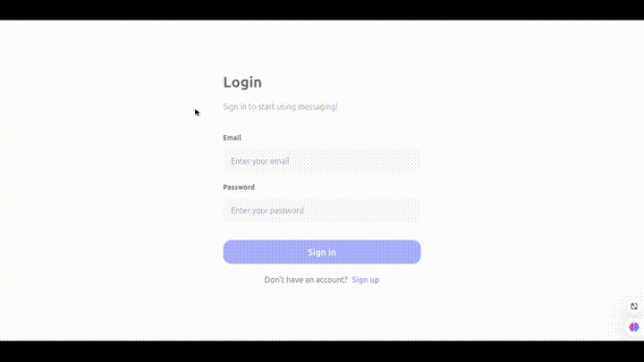
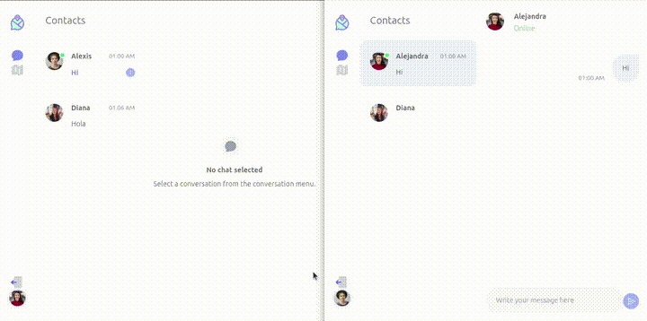
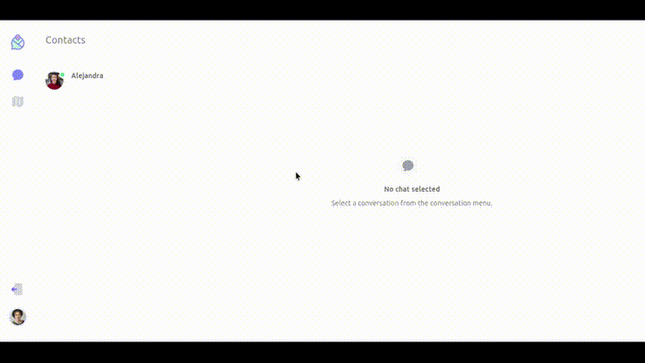

# Temapi

Temapi is a real-time chat application that also provides user tracking on a map. This application allows users to communicate in real time and visualize the locations of other registered users.

Real-time location is simulated by allowing users to move their markers on the map manually.

## Features

- **Real-Time Chat**: Instantly exchange messages with other users registered.

- **Simulated Real-Time Map Tracking**: View the locations of users on an interactive map. Users can manually adjust their markers on the map to simulate live movement.

- **User Authentication**: Users must authenticate to interact in the chat and be visible on the map.

## Tech Stack

### Frontend
- **React**: Library for building the user interface.
- **Redux**: Global state manager.
- **Axios**: HTTP requests.
- **Tailwind CSS**: CSS framework.

### Backend
- **Express**: Server framework for Node.js.
- **Socket.io**: Real-time communication protocol.
- **MongoDB**: Non-Relational database.

## Demo

https://temapi-app.vercel.app/  
(It may take approximately 30 seconds to wake up the server).

**Create an Account**: To access the application features, please register by creating an account.

**Real-Time Chatting**: Once registered, you can chat in real time with other users registered,. Below is a demonstration showing how easy it is to start a conversation.

**Map Tracking**: In addition to chat, the app provides a real-time map feature where users can simulate location updates by adding and dragging a marker. This allows all users to see each other’s locations in real time.

**Delete Account**: If desired, you can delete your account at any time include the messages.

